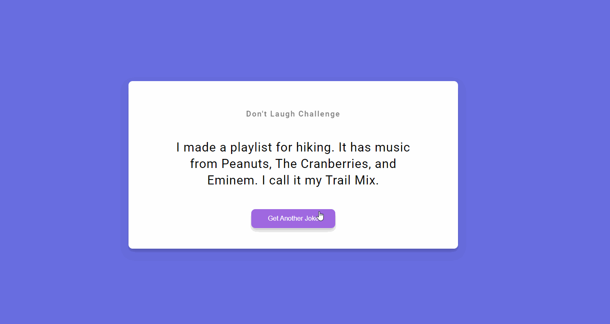

# Dad Jokes 



## 🦉 Main information

Simple Dad Jokes application where it gives us a joke.

The project goal:
- the user need to click a button to get a new joke
- use a third part API 
- use the fetch API that's built into the browser to make a request and get an object with an Id, a joke and a status (fetch JSON data)
- use fetch Api and async/await syntax in JavaScript
- set up in HTML, style it with CSS and add the functionality with JavaScript

## 🦊 Useful links 

Dad Jokes API

```
 https://icanhazdadjoke.com/api
```

## ⚡ Built With
[HTML5](https://www.w3schools.com/html/) / [CSS3](https://www.w3schools.com/css/) / [JavaScript](https://www.w3schools.com/js/)
